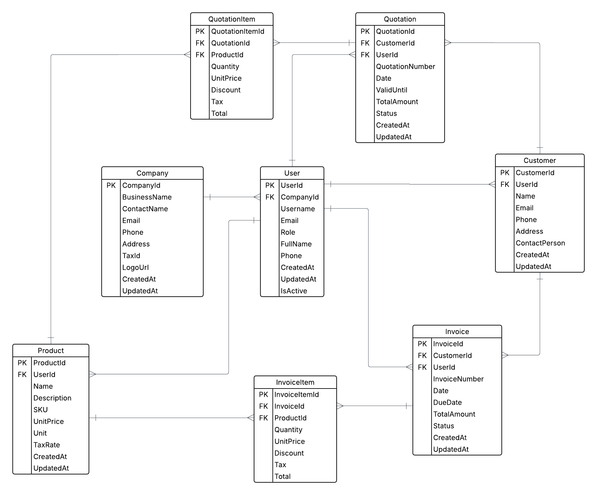

# 📦 Billora Backend - ASP.NET Core Web API

**Billora** is a billing and invoicing system designed to handle quotations, invoices, customers, products, and company management. This repository contains the backend implementation using **ASP.NET Core Web API**.

---

## 🚀 Features

- User authentication and role-based access control
- Quotation management (create, update, send, expire)
- Invoice management with line items and tax/discount support
- Customer management
- Product catalog with pricing and tax rates
- Company profile and branding
- Timestamps and status tracking
- Designed for multi-tenant (per company) use

---

## 🧱 Tech Stack

- **Framework:** ASP.NET Core 9.0 Web API
- **Database:** SQL Server / PostgreSQL (configurable)
- **ORM:** Entity Framework Core
- **Authentication:** JWT Bearer Tokens
- **API Docs:** Swagger (Swashbuckle)
- **Logging:** Serilog
- **Containerization (optional):** Docker

---

## 📁 Project Structure
```
BilloraBackend/Api/
│
├── Controllers/ # API endpoints
├── Data/ # DbContext and seeding
├── Dto/ # Data Transfer Objects
├── Helper/ # Utility classes and QueryObjects
├── Interfaces/ # Service and repository contracts
├── Mappers/ # Manual mapping logic
├── Migrations/ # EF Core migrations
├── Models/ # Entity models (EF Core)
├── Services/ # Business logic
├── Repositories/ # Data access layer
├── appsettings.json # Configuration
└── Program.cs # Entry point
```
---

## 🗂 Entity Relationship Diagram



---

## 🔧 Getting Started

### Prerequisites

- [.NET 9 SDK](https://dotnet.microsoft.com/download)
- SQL Server or PostgreSQL (based on your configuration)
- Visual Studio or VS Code
- Optional: Docker, Postman

---

### Installation

1. **Clone the repository:**

```bash
git clone https://github.com/your-username/billora-backend.git
cd BilloraBackend/api
"ConnectionStrings": {
  "DefaultConnection": "Data Source=DesktopName\\SQLEXPRESS;Initial Catalog=Databasename;Integrated Security=True;Connect Timeout=30;Encrypt=False;TrustServerCertificate=False;ApplicationIntent=ReadWrite;MultiSubnetFailover=False"
  }
dotnet ef database migrations add init
dotnet ef database update
dotnet watch run
```
---

## Access API documentation:

Open your browser at http://localhost:yourport/swagger to view Swagger UI.

---

## 🛡 Authentication

- JWT Bearer Token-based authentication
- Roles: Admin, User
- Protected endpoints require authorization headers

---

## 📝 License

This project is licensed under the [MIT License](LICENSE).

---

## ✨ Credits

Built with ❤️ by [@mostafijur566](https://github.com/mostafijur566)
